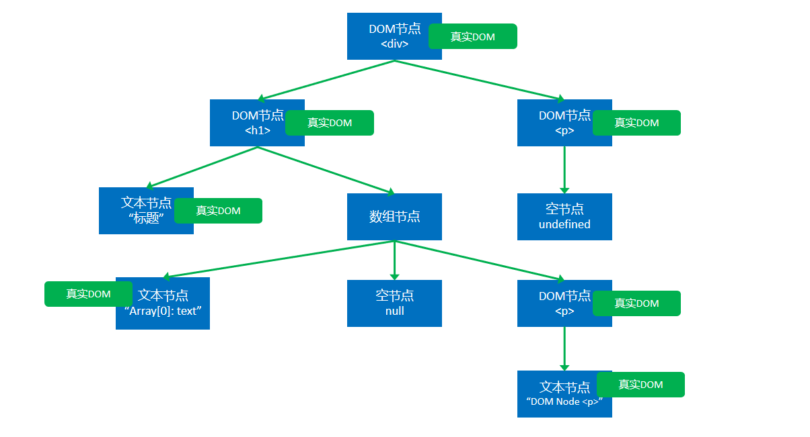
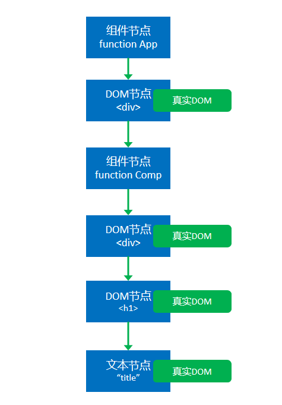

# 渲染过程 - render

渲染：生成用于显示的对象，以及将这些对象形成真实的 DOM 对象

[toc]

## 基本术语

1. React 元素：React Element, 通过 `React.createElement` 创建(语法糖：JSX 表达式)

    example：

    `<div><h1>TITLE</h1></div>`
    `<App />`

2. React 节点：专门用于渲染到 UI 界面的对象，React 会通过 React 元素创建 React 节点，React DOM 一定是通过 React 节点进行渲染的

    节点类型：
    - React DOM 节点（React DOMComponentNode）：创建该节点的 React 元素类型是一个字符串
    - React 组件节点（React CompositeNode）：创建该节点的 React 元素类型是一个函数(`type: class App` - App 类(本质也是函数) / `type: f CheckGroup` - CheckGroup 函数)
    - React 文本节点（React TextNode）：由字符串创建
    - React 空节点（React EmptyNode）：由 `null / undefined / false` 创建
    - React 数组节点（React ArrayNode）：由数组创建

3. 真实 DOM：通过 document.createElement 创建的 DOM

## 首次渲染（新节点渲染）

```ReactDOM.render(app, 挂载真实DOM节点)```

1. 通过参数的值创建节点

2. 根据不同的节点，做不同的事情
    - 文本节点(app = "example" / 2): 通过 `document.createTextNode("example");` 创建真实的文本节点（现在不会渲染到页面上）
    - 空节点(app = null / false / undefined / true): 创建 React 节点，什么都不做（对象中此节点依旧占位）
    - 数组节点(app = [1, 2, 3])，遍历数组，将数组每一项进行递归创建真实的文本节点（n 维数组递归，不可嵌套对象类型）
    - DOM 节点：通过 `document.createElement("div");` 创建真实的 DOM 对象；遍历对应 React 元素的 children 属性，进行递归操作（根据节点类型进行反复操作，直到遍历结束）
    - 组件节点：
        - 函数组件：调用函数，得到返回内容进行节点创建
        - 类组件：
        （1）创建类的实例（调用 constructor 方法）；
        （2）立即调用对象的生命周期方法（static getDerivedStateFromProps）将传入的 props 映射到 state；
        （3）运行该对象的render方法，拿到节点对象（递归调用）；
        （4）将该组件的componentDidMount加入到执行队列（先进先出，先进先执行），当整个虚拟 DOM 树全部构建完毕，并且将真实的 DOM 对象加入到容器中后，执行该队列。

3. 生成虚拟 DOM 树之后，保存起来，以便后续使用

4. 将生成的真实 DOM 对象，依次加入到此根节点真实 DOM 对象，最后将根节点加入容器中（渲染到页面）

    ```jsx
    // DOM 节点
    const app = <div>
        <h1>
            标题
            {["Array[0]: text", null, <p>Array[2]: DOM Node &lt;p&gt;</p>]}
        </h1>
        <p>
            {undefined}
        </p>
    </div>
    ```

    初次渲染 - 以上代码生成的虚拟 DOM 树：

    

    ```jsx
    // 组件节点
    export default function App(props){
        return (
            <div>
                <Comp />
            </div>
        )
    }

    function Comp(props){
        return (
            <div>
                <h1>title</h1>
            </div>
        )
    }
    ```

    虚拟 DOM 树：

    

    ```jsx
    // 组件节点 - 类组件
    import React, { Component } from 'react'
    class App extends Component{
        constructor(props){
            super(props);
            console.log(1, "App constructor");
        }
        static getDerivedStateFromProps(){
            console.log(2, "App getDerivedStateFromProps");
            return null; // 不对 state 进行任何操作
        }
        state = {} // 初始化 state ，否则 getDerivedStateFromProps 方法会警告你没有必要运行此函数
        componentDidMount(){
            console.log(8, "App componentDidMount");
        }
        render(){
            console.log(3, "App render");
            return (
                <div>
                    <Comp />
                </div>
            )
        }
    }

    class Comp extends Component{
        constructor(props){
            super(props);
            console.log(4, "Comp constructor");
        }
        static getDerivedStateFromProps(){
            console.log(5, "Comp getDerivedStateFromProps");
            return null;
        }
        state = {}
        componentDidMount(){
            console.log(7, "Comp componentDidMount");
        }
        render(){
            console.log(6, "Comp render");
            return (
                <div>
                    <h1>title</h1>
                </div>
            )
        }
    }
    ReactDOM.render(<App />, document.getElementById("root"));
    // 输出顺序如上面的序号标识
    ```

    虚拟 DOM 树：

    

## 更新与卸载

### 更新的场景

1. 重新调用 `ReactDOM.render`, 完全重新生成节点树（触发根节点更新）
2. 类组件（实例）中调用 `this.setState()`, 会导致该实例所在的节点及其子节点的更新

    ```jsx
    import React, { Component } from 'react'
    class App extends Component{
        state = {}
        render(){
            return (
                <div>
                    <CompA />
                </div>
            )
        }
    }
    class CompA extends Component{
        state = {
            a: "CompA a",
            b: "CompA b"
        }
        render(){
            return (
                <div>
                    <h1>{this.state.a}</h1>
                    <CompB n={this.state.b} />
                    <button onClick={() => {
                        this.setState({
                            b: this.state.b + 1
                        })
                    }}>change CompA state</button>
                </div>
            )
        }
    }
    function CompB(props){
        return (
            <div>
                <h1>CompB Content: {props.n}</h1>
                <CompC n={props.n} />
            </div>
        )
    }
    class CompC extends Component{
        render(){
            return (
                <div>
                    <h1>CompC Content: {this.props.n}</h1>
                </div>
            )
        }
    }
    ReactDOM.render(<App />, document.getElementById("root"));
    ```

### 节点的更新

1. 如果调用的是 `ReactDOM.render`，进入根节点的**对比更新（diff算法）**
2. 如果调用的 `setState`
    - 运行生命周期函数 `getDerivedStateFromProps`, 混合 state
    - 运行生命周期函数 `shouldComponentUpdate`, 如果返回 false，终止当前流程
    - 运行 render，得到一个新节点，进入该新的节点的**对比更新（diff算法）**
    - 将生命周期函数 `getSnapshotBeforeUpdate` 加入执行队列，以待将来执行
    - 将生命周期函数 `componentDidUpdate` 加入执行队列，以待将来执行
3. 完成真实 DOM 更新
4. 依次调用执行队列中的 `componentDidMount`
5. 依次调用执行队列中的 `getSnapshotBeforeUpdate`
6. 依次调用执行队列中的 `componentDidUpdate`
7. 依次调用执行队列中的 `componentWillUnMount`

### 对比更新

将新产生的节点对比之前虚拟 DOM 中的节点，发现差异，进行更新。

<em style="color: #f40;">问题：对比之前DOM树中哪个节点???</em>

React为了提高对比效率，做出以下假设:

> 1. 假设 `节点不会出现层级的移动` （对比时，直接找到旧树中对应位置的节点进行对比） 时间复杂度： O(1)
> 2. 不同的节点类型会生成不同的结构：
    相同的节点类型：节点本身类型相同，如果是由 React 元素生成，type 值（f / class）还必须一致
    其他的，都属于不相同的节点类型
> 3. 多个兄弟通过唯一标识（key）来确定对比的新节点
    key值的作用：用于通过旧节点，寻找对应的新节点，如果某个旧节点有key值，则其更新时，会寻找相同层级中的相同key值的节点，进行对比；遍历该新的 React 元素的子元素，递归对比更新。

#### 找到了对比目标

1. 判断节点类型是否一致

    - **一致**

        根据不同节点，做不同的事
        空节点：不做任何事
        DOM 节点：直接重用之前的真实 DOM 对象；将其属性的变化记录下来（此时不会在页面上更新，会在最后进行统一更新）

    - **不一致**

#### 未找到对比目标
