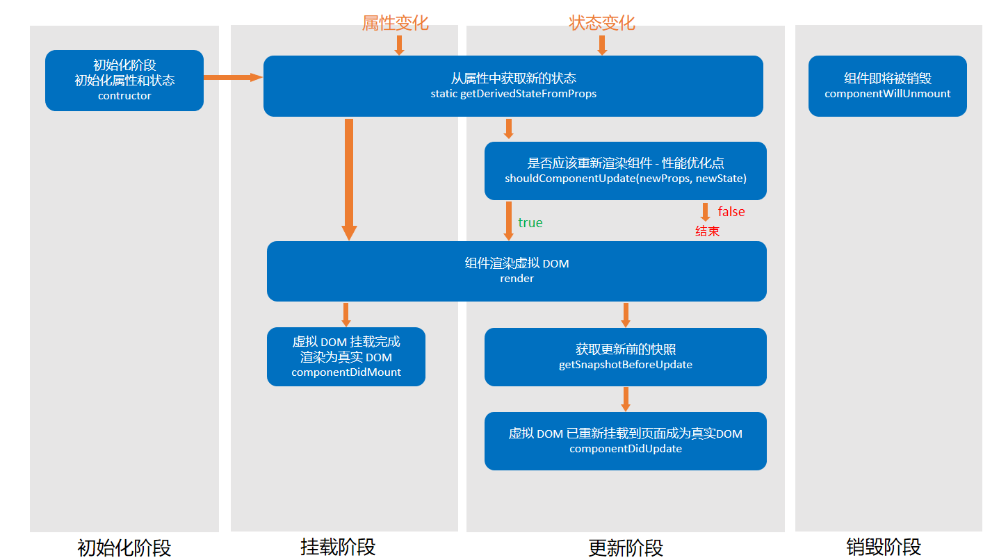

# React 组件生命周期

[toc]

## 函数组件

函数组件创建 - 销毁简单 → 函数调用即重新创建组件，旧的组件即刻被销毁

## 类组件

单个组件对象的生命周期

1. React version < 16.0.0

    初始化阶段 ========================== ：

    - contructor()
        初始化属性和状态 → 同一个组件只会执行一次
        为了避免出现渲染问题，构造函数中不能调用 setState

    挂载阶段 ========================== ：

    - componentWillMount
        组件即将被挂载，只会运行一次
        可以使用 setState，不允许使用 setState（因为某些情况下，该函数会调用多次）

    - **render**
        渲染函数，返回的 React 元素会挂载到虚拟 DOM 树上，最终渲染到真实 DOM 中
        重新渲染就会调用此函数
        此函数中调用 setState 会出现无限递归渲染

    - **componentDidMount**
        组件挂载完成，执行一次

    更新阶段（属性变化 / 状态变化） ========================== ：

    - componentWillReceiveProps(newProps)
        newProps => 新的属性值（属性重新赋值也会执行，即使值并没有改变）
    
    - **shouldComponentUpdate(newProps, newState)** - 必须返回 boolean 值
        指示 React 组件是否应该更新
        返回 true 则会调用 render 重新渲染
        返回 false 则不会调用 render 重新渲染
        所以，这是一个 **性能优化点**
    
    - componentWillUpdate(newProps, newState)
        组件即将重新渲染（render 之前）

    - render

    - componentDidUpdate(oldProps, oldState)
        组件已经完成重新渲染
        一般在此函数中操作 dom
    
    销毁阶段 ========================== ：

    - **componentWillUnmount**
        组件被销毁 - 从虚拟 DOM 树种移除
        通常用来销毁组件依赖的资源（如：计时器等）

2. React version >= 16.0.0

    

    初始化阶段 ========================== ：

    - contructor()
        初始化阶段 => 初始化属性和状态 → 同一个组件只会执行一次
        为了避免出现渲染问题，构造函数中不能调用 setState

    挂载阶段 ========================== ：

    - getDerivedStateFromProps - static
        从属性中获取新的状态

    - **render**
        渲染函数，返回的 React 元素会挂载到虚拟 DOM 树上，最终渲染到真实 DOM 中
        重新渲染就会调用此函数
        此函数中调用 setState 会出现无限递归渲染

    - **componentDidMount**
        组件挂载完成，执行一次

    更新阶段（属性变化 / 状态变化） ========================== ：

    - **shouldComponentUpdate(newProps, newState)** - 必须返回 boolean 值
        指示 React 组件是否应该更新
        返回 true 则会调用 render 重新渲染
        返回 false 则不会调用 render 重新渲染
        所以，这是一个 **性能优化点**

    - render

    - getSnapshotBeforeUpdate
        获取更新前的快照

    - componentDidUpdate(oldProps, oldState)
        组件已经完成重新渲染
        一般在此函数中操作 dom
    
    销毁阶段 ========================== ：

    - **componentWillUnmount**
        组件被销毁 - 从虚拟 DOM 树种移除
        通常用来销毁组件依赖的资源（如：计时器等）

